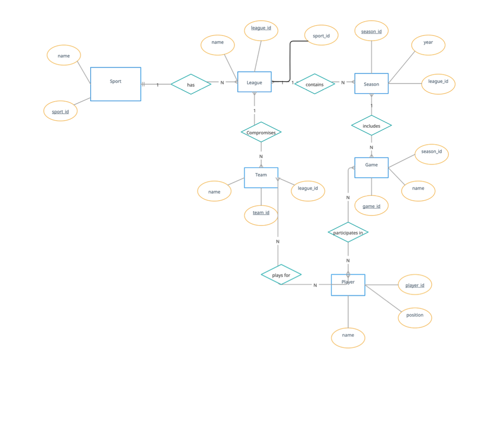

# 🏀🏈⚾🏒 StatSphere: Sports Statistics Database

## 📽️ Video Demonstration

## 🚀 Motivation

As a passionate sports fan and data enthusiast, I wanted to build **StatSphere** to make sports statistics more **accessible, interactive, and insightful**. Instead of browsing through multiple sites, **StatSphere** provides a **one-stop solution** to query stats for the **NFL, NBA, MLB, and NHL**—all from the command line!

Whether you're a **fantasy sports player**, **stat geek**, or **just curious about your favorite players and teams**, this tool is for you!

## 🌟 Features

✅ **Multi-League Support** – Covers **NFL, NBA, MLB, and NHL**
✅ **Comprehensive Data** – Stores **teams, players, games, and seasons**
✅ **User-Friendly CLI** – Simple and efficient interface
✅ **Data Integrity** – Uses **relational database principles** for consistency

## 🛠️ Installation

### 🔹 Prerequisites
- **Python 3** → [Download Python](https://www.python.org/downloads/)
- **SQLite3** → [Download SQLite](https://www.sqlite.org/download.html) (if not installed)

### 🔹 Setup Steps
1️⃣ Clone the repository:
git clone https://github.com/shres1974/statsphere.git
cd statsphere

2️⃣ Ensure Python 3 and SQLite3 are installed.

3️⃣ Run the application:
python app.py
or
python3 app.py

4️⃣ Follow the on-screen menu instructions.

## 🎮 How to Use

🔹 **Option 1** – List all teams
🔹 **Option 2** – Show player stats *(e.g., "Tom Brady" or "Dak Prescott")*
🔹 **Option 3** – List games in **NFL 2021** *(e.g., enter "NFL" and "2021")*

📝 **Note**: The database file `statsphere.db` will be automatically created on the first run.

## 📷 Image Support
To add an image, place your **PNG logo** in the `assets/` folder and update the file path in:

You can replace `assets/statsphere.png` with your actual file location.

## 📺 Video Demonstration
Click below to watch **StatSphere in action!**

Enjoy using **StatSphere**! 🎉 Let me know if you have any questions or feature requests. 🚀

### 🔥 What's New in This Version?
✅ **Emojis** for a more engaging README
✅ **Motivation Section** to explain the purpose of the project
✅ **PNG Image Support** – Add your logo inside the assets/ folder
✅ **Clickable YouTube Thumbnail** to link directly to your video

This will give your README a more **professional and engaging look**! 🚀 Let me know if you need any modifications. 🎯
